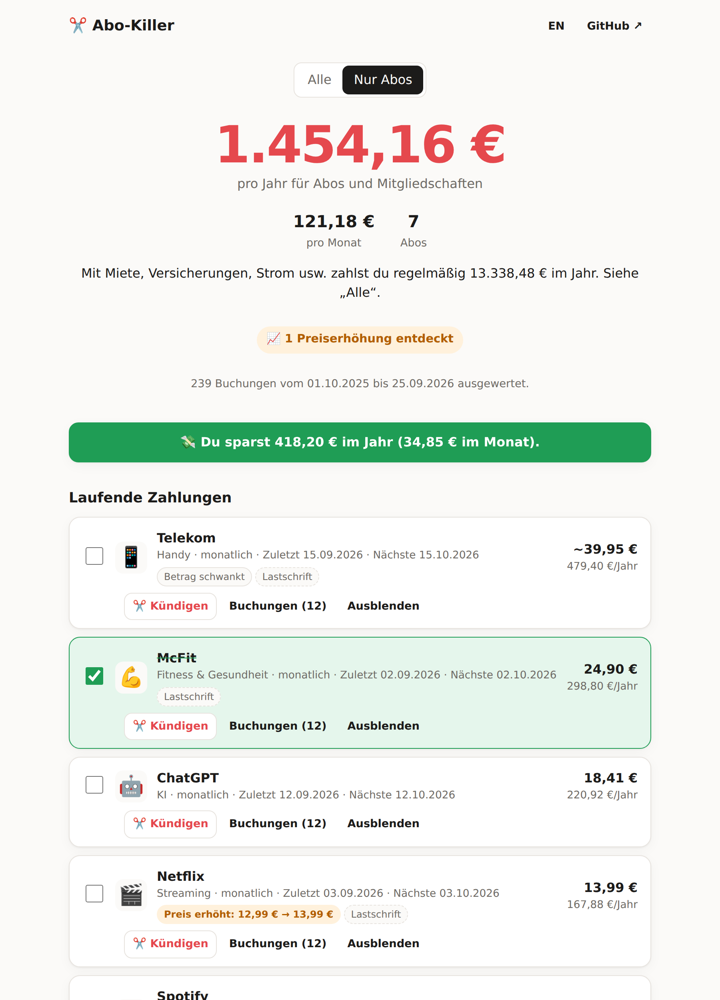

<div align="center">

# ✂️ Abo-Killer

**Kontoauszug rein, alle Abos raus. Und direkt kündigen.**

Findet jedes Abo und jeden Vertrag in deinem Kontoauszug, zeigt dir, was dich das im Jahr kostet, entdeckt heimliche Preiserhöhungen und schreibt dir die Kündigung.
Kostenlos, ohne Anmeldung, und deine Bankdaten verlassen nie deinen Browser.

**[➜ Jetzt ausprobieren](https://vqorn.github.io/Trend/)** · [English](#english)



</div>

## Warum?

Die meisten Leute zahlen für Abos, die sie vergessen haben: die Testversion, die still weiterläuft, das Fitnessstudio aus dem Januar, der Streamingdienst für eine einzige Serie. Apps wie Finanzguru finden das auch, wollen dafür aber Zugriff auf dein Bankkonto und in der Premium-Version Geld.

Abo-Killer braucht nur die CSV-Datei, die dir jedes Online-Banking gibt. Alles wird auf deinem eigenen Gerät ausgewertet.

## Was es kann

- 🔍 **Findet wiederkehrende Zahlungen** automatisch: wöchentlich, monatlich, vierteljährlich, halbjährlich, jährlich
- 💶 **Zeigt die echten Kosten**: pro Monat und pro Jahr, getrennt nach Abos und Fixkosten wie Miete oder Versicherung
- 📈 **Entdeckt Preiserhöhungen**, z. B. „Netflix: 12,99 € → 13,99 €“
- 💸 **Spar-Rechner**: Hak an, was du nicht brauchst, und sieh sofort, wie viel du sparst
- ✉️ **Kündigungsschreiben** mit einem Klick, inkl. Widerruf der SEPA-Lastschrift, zum Kopieren, Mailen oder Drucken
- 🔗 **Direktlinks zur Kündigungsseite** bei bekannten Anbietern
- 🧾 **PayPal-Zahlungen** werden dem echten Händler zugeordnet (z. B. „Ihr Einkauf bei Spotify“)
- 🏦 **Über 110 bekannte Anbieter** (Streaming, Handy, Fitness, Software, KI, Zeitungen, Versicherungen …)
- 🌙 Dark Mode, Handy-tauglich, Deutsch und Englisch

## Unterstützte Banken

Getestet mit den CSV-Exporten von:

**Sparkasse** · **DKB** · **ING** · **N26** · **Comdirect** · **Commerzbank** · **Deutsche Bank** · **Postbank** · **Volksbank / Raiffeisenbank** · **Revolut** · **PayPal**

Andere Banken klappen meistens auch, weil die Spalten automatisch erkannt werden. Wenn deine Bank nicht geht: [Issue aufmachen](https://github.com/vqorn/Trend/issues) mit den Spaltenüberschriften (bitte **keine** echten Buchungen posten).

## So geht's

1. Im Online-Banking die Umsätze als **CSV** exportieren, am besten **12 Monate**.
2. Datei auf [vqorn.github.io/Trend](https://vqorn.github.io/Trend/) ziehen.
3. Liste durchgehen, abhaken, kündigen. Fertig.

Keine Datei zur Hand? Auf der Seite gibt es einen Knopf **„Mit Beispieldaten ausprobieren“**.

## Datenschutz, und zwar wirklich

- Es gibt **keinen Server**. Die Seite ist eine statische HTML-Datei.
- Die Seite hat eine Content-Security-Policy mit `connect-src 'none'`. Das heißt: Der Browser **verbietet** der Seite technisch, irgendetwas zu senden. Selbst wenn sie wollte, könnte sie es nicht.
- Kein Tracking, keine Cookies, keine Analytics, keine externen Schriftarten oder Skripte.
- Du willst es ganz sicher? Lade `index.html` aus dem [neuesten Build](https://vqorn.github.io/Trend/) herunter (Rechtsklick, „Seite speichern unter“), schalte das WLAN aus und öffne die Datei. Funktioniert komplett offline.

## Grenzen (ehrlich gesagt)

- Die Erkennung ist eine **Schätzung**. Zwei Zahlungen im gleichen Abstand sind noch kein Abo, und manchmal übersieht es was. Deshalb kannst du alles ausblenden oder aufklappen und prüfen.
- Jahresabos erkennt es sicher erst, wenn zwei Zahlungen im Zeitraum liegen. Bekannte Anbieter mit nur einer Zahlung landen unter „Möglicherweise auch ein Abo“.
- Das Kündigungsschreiben ist eine Vorlage, **keine Rechtsberatung**.

## Mitmachen

Am meisten hilft: **neue Anbieter** in [`src/merchants.js`](src/merchants.js) eintragen. Das ist eine einfache Liste:

```js
{ name: 'Netflix', re: /netflix/i, cat: 'video', url: 'https://www.netflix.com/cancelplan' },
```

`url` bitte nur, wenn es wirklich die offizielle Kündigungs- oder Konto-Seite ist. Und ein neues Bankformat gerne mit einem Test in [`test/formats.test.js`](test/formats.test.js) (nur ausgedachte Buchungen!).

### Entwickeln

Keine Abhängigkeiten, nur Node.js ≥ 20:

```bash
npm test          # Tests
npm run dev       # lokaler Server auf http://localhost:8080
npm run build     # baut dist/index.html (eine einzige Datei, läuft auch offline)
```

```
src/csv.js        CSV lesen (Encoding, Trennzeichen, Anführungszeichen)
src/columns.js    Bankformate erkennen, Beträge und Datumsangaben parsen
src/merchants.js  bekannte Anbieter und Kategorien
src/detect.js     Erkennung der wiederkehrenden Zahlungen
src/letter.js     Kündigungsschreiben
src/app.js        Oberfläche
```

---

## English

**Drop in your bank statement, get every subscription out. Then cancel it.**

Abo-Killer finds recurring payments in a bank CSV export, shows what they cost per year, spots price increases and writes the cancellation letter for you. It runs 100% in your browser: no server, no account, and a `connect-src 'none'` CSP that makes it technically impossible for the page to send your data anywhere. Works offline as a single HTML file.

Built for German banks first (Sparkasse, DKB, ING, N26, Comdirect, Commerzbank, Deutsche Bank, Postbank, Volksbank), plus Revolut and PayPal. Columns are auto-detected, so many other banks work too. The UI is available in German and English.

**[➜ Try it](https://vqorn.github.io/Trend/)**

## Lizenz

[MIT](LICENSE)
